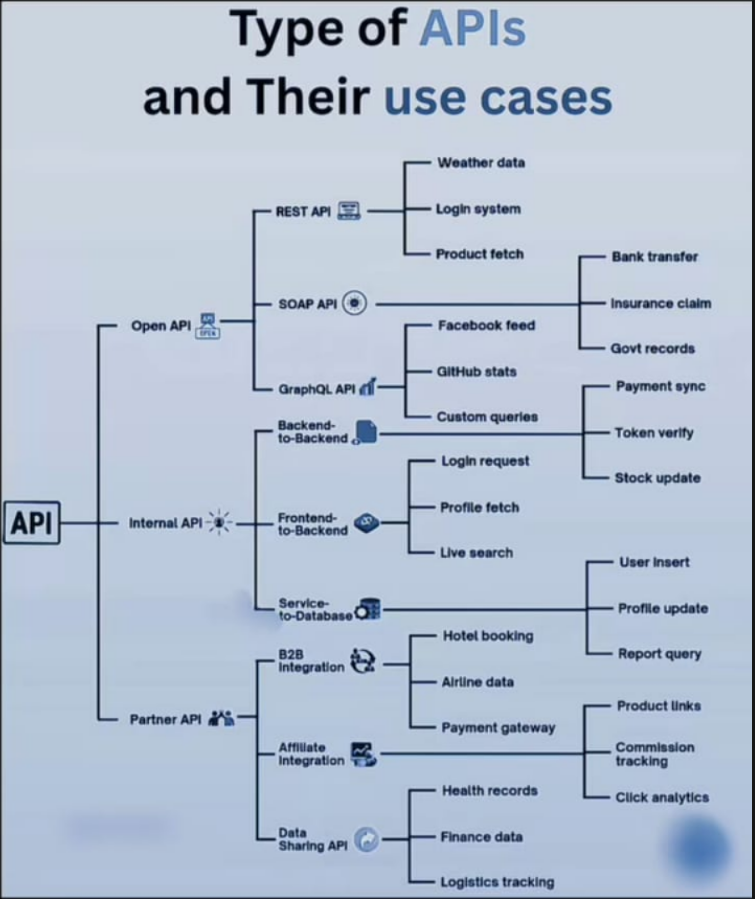
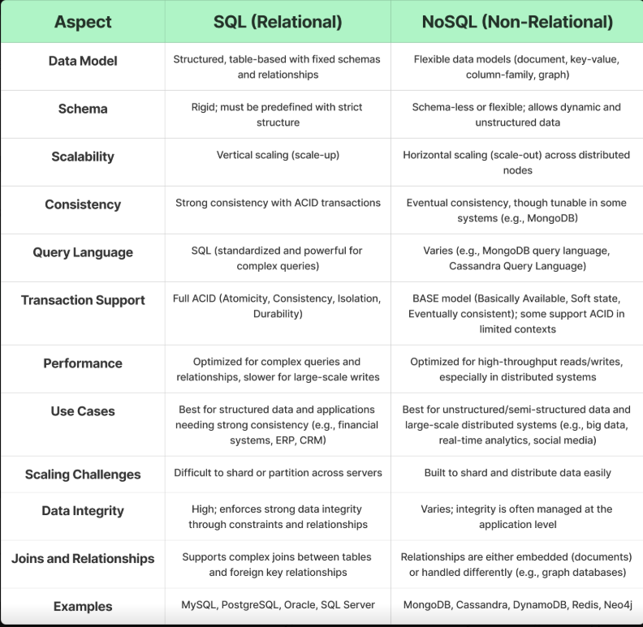
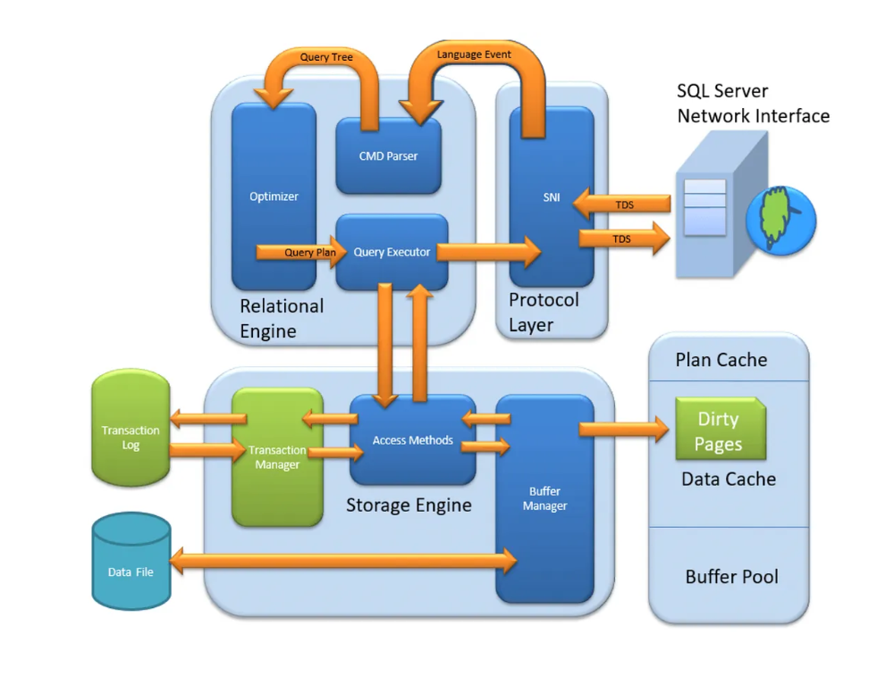
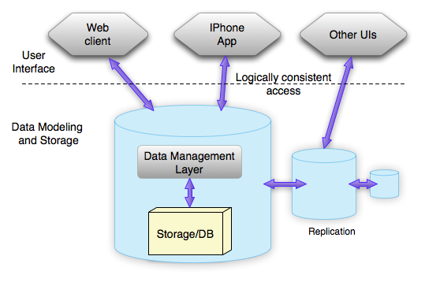
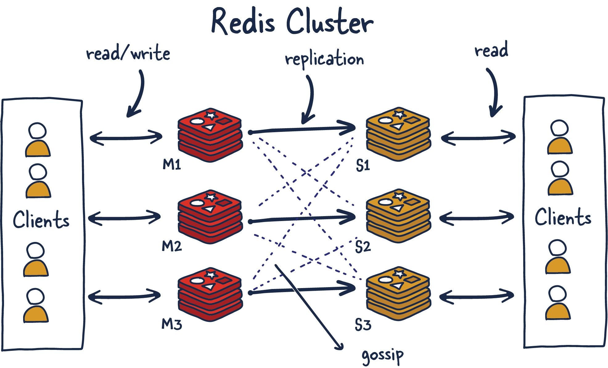

# APIs and their use cases

# 1. Open API 
 - An Open API, also known as a Public API, is an application programming interface that is available to developers and other users with minimal restrictions. It is intended for external users (developers at other companies, for example) and can be freely used to access certain features or data of a service or application. Open APIs are often used to encourage third-party developers to create applications that integrate with the service, thereby expanding its ecosystem.

### how it works - 
        1. A developer or user sends a request to the Open API endpoint, typically using HTTP methods such as GET, POST, PUT, or DELETE.
        2. The Open API processes the request and performs the necessary operations, such as retrieving data from a database, performing calculations, or interacting with other services.
        3. The Open API then returns a response to the developer or user, which may include data in formats such as JSON or XML, status codes indicating the success or failure of the request, and any relevant error messages if applicable.

## a. Rest api 
     REST (Representational State Transfer) API is a type of web API that follows the principles of REST architecture. It uses standard HTTP methods (GET, POST, PUT, DELETE) and is designed to be stateless, meaning that each request from a client to a server must contain all the information needed to understand and process the request. REST APIs typically use JSON or XML for data exchange and are widely used for building web services and applications.
    Ex - Twitter API, Google Maps API, Facebook Graph API, etc.

### how it works -
        1. A client sends an HTTP request to the REST API endpoint, specifying the desired resource and the HTTP method (e.g., GET, POST, PUT, DELETE).
        2. The REST API processes the request, performs the necessary operations (such as retrieving data from a database, creating a new resource, updating an existing resource, or deleting a resource), and generates a response.
        3. The REST API returns a response to the client, which may include data in formats such as JSON or XML, status codes indicating the success or failure of the request, and any relevant error messages if applicable.

## b. Soap api 
    SOAP (Simple Object Access Protocol) is a protocol for exchanging structured information in the implementation of web services. It is a messaging protocol that uses XML for its message format and relies on other application layer protocols, most notably HTTP and SMTP, for message negotiation and transmission.
    Ex - Salesforce SOAP API, Amazon S3 SOAP API, etc.

### how it works -
        1. A client sends a SOAP request to the SOAP API endpoint, typically using HTTP as the transport protocol. The SOAP request is an XML message that contains the necessary information for the server to process the request.
        2. The SOAP API processes the request, performs the necessary operations (such as retrieving data from a database, creating a new resource, updating an existing resource, or deleting a resource), and generates a SOAP response. The SOAP response is also an XML message that contains the results of the request, including any data, status codes, and error messages if applicable.
        3. The SOAP API returns the SOAP response to the client, which can then parse the XML message to extract the relevant information and use it as needed.
 
## c. GraphQL api 
    GraphQL is a query language for APIs and a runtime for executing those queries with your existing data. It provides a more efficient, powerful, and flexible alternative to REST. With GraphQL, clients can request exactly the data they need, and nothing more, which can reduce the amount of data transferred over the network and improve performance. 
    Ex - GitHub GraphQL API, Shopify GraphQL API, etc.

### how it works -
        1. A client sends a GraphQL query to the GraphQL API endpoint, typically using HTTP POST. The GraphQL query is a string that specifies the data the client wants to retrieve or manipulate, as well as any variables needed for the query.
        2. The GraphQL API processes the query, executes the necessary operations (such as retrieving data from a database, creating a new resource, updating an existing resource, or deleting a resource), and generates a response. The response is typically in JSON format and contains the requested data, as well as any errors if applicable.
        3. The GraphQL API returns the response to the client, which can then parse the JSON message to extract the relevant information and use it as needed.

# 2.Internal API
- An Internal API, also known as a Private API, is an application programming interface that is intended for use within an organization. It is not exposed to external developers or users and is typically used to facilitate communication between different systems, applications, or services within the same organization. Internal APIs can help improve efficiency, streamline processes, and enable better integration of internal systems.

## a. Backend-to-Backend API 
     A Backend-to-Backend API is a type of internal API that allows different backend systems or services to communicate with each other. This can be used for various purposes, such as data synchronization, service orchestration, or enabling microservices architecture. Backend-to-Backend APIs are typically designed to be secure and efficient, as they often handle sensitive data and require high performance.
     Ex - Login API, Payment API, etc.

### how it works -

        1. A backend service sends a request to another backend service's API endpoint, typically using HTTP or another communication protocol. The request may include data in formats such as JSON or XML, as well as any necessary authentication credentials.
        2. The receiving backend service processes the request, performs the necessary operations (such as retrieving data from a database, performing calculations, or interacting with other services), and generates a response. The response may include data in formats such as JSON or XML, status codes indicating the success or failure of the request, and any relevant error messages if applicable.
        3. The receiving backend service returns the response to the requesting backend service, which can then parse the response and use the data or information as needed to continue processing its own operations.

## b. Backend-to-Frontend API
     A Backend-to-Frontend API is a type of internal API that allows the backend of an application to communicate with the frontend. This is commonly used in web applications, where the frontend (the user interface) needs to retrieve data or perform actions by communicating with the backend (the server). Backend-to-Frontend APIs are often designed to be responsive and efficient, as they directly impact the user experience.
     Ex - User profile API, Product catalog API, etc.

### how it works -

        1. The frontend of an application sends a request to the backend API endpoint, typically using HTTP methods such as GET, POST, PUT, or DELETE. The request may include data in formats such as JSON or XML, as well as any necessary authentication credentials.
        2. The backend API processes the request, performs the necessary operations (such as retrieving data from a database, performing calculations, or interacting with other services), and generates a response. The response may include data in formats such as JSON or XML, status codes indicating the success or failure of the request, and any relevant error messages if applicable.
        3. The backend API returns the response to the frontend, which can then parse the response and use the data or information to update the user interface, display information to the user, or perform other actions as needed.
  
## c. Service-to-Database API
    A Service-to-Database API is a type of internal API that allows a service or application to interact with a database. This can include operations such as querying data, inserting new records, updating existing records, or deleting records. Service-to-Database APIs are typically designed to be secure and efficient, as they often handle sensitive data and require high performance.
    Ex - User management API, Inventory management API, etc.

### how it works -

        1. A service or application sends a request to the Service-to-Database API endpoint, typically using a communication protocol such as HTTP or a database-specific protocol. The request may include data in formats such as JSON or XML, as well as any necessary authentication credentials.
        2. The Service-to-Database API processes the request, performs the necessary operations on the database (such as querying data, inserting new records, updating existing records, or deleting records), and generates a response. The response may include data in formats such as JSON or XML, status codes indicating the success or failure of the request, and any relevant error messages if applicable.
        3. The Service-to-Database API returns the response to the requesting service or application, which can then parse the response and use the data or information as needed to continue processing its own operations.

# 3. Partner API
- A Partner API is an application programming interface that is shared with specific business partners or collaborators. It is not publicly available and is typically used to enable integration between the systems of different organizations. Partner APIs can facilitate data exchange, streamline processes, and enable new business opportunities by allowing partners to access certain features or data of a service or application in a controlled manner.

## a. B2B (Business-to-Business) - 
    API is a type of Partner API that is specifically designed for use between businesses. It allows companies to integrate their systems and services with those of their partners, enabling seamless communication and collaboration. B2B APIs can be used for various purposes, such as supply chain management, payment processing, or customer relationship management.
    Ex - E-commerce API, Payment gateway API, etc.

### how it works -

        1. A business partner sends a request to the B2B API endpoint, typically using HTTP methods such as GET, POST, PUT, or DELETE. The request may include data in formats such as JSON or XML, as well as any necessary authentication credentials.
        2. The B2B API processes the request, performs the necessary operations (such as retrieving data from a database, performing calculations, or interacting with other services), and generates a response. The response may include data in formats such as JSON or XML, status codes indicating the success or failure of the request, and any relevant error messages if applicable.
        3. The B2B API returns the response to the business partner, which can then parse the response and use the data or information as needed to continue processing its own operations or to integrate with its own systems.

## b. Affiliate API - 
    An Affiliate API is a type of Partner API that is used in affiliate marketing programs. It allows affiliates (partners) to access certain features or data of a service or application, such as product information, pricing, or tracking data. Affiliate APIs enable affiliates to promote products or services and earn commissions based on their performance.
    Ex - Product information API, Commission tracking API, etc.

### how it works -
    1. An affiliate sends a request to the Affiliate API endpoint, typically using HTTP methods such as GET, POST, PUT, or DELETE. The request may include data in formats such as JSON or XML, as well as any necessary authentication credentials.
    2. The Affiliate API processes the request, performs the necessary operations (such as retrieving data from a database, performing calculations, or interacting with other services), and generates a response. The response may include data in formats such as JSON or XML, status codes indicating the success or failure of the request, and any relevant error messages if applicable.
    3. The Affiliate API returns the response to the affiliate, which can then parse the response and use the data or information as needed to promote products or services, track performance, or earn commissions based on their affiliate marketing efforts.

## c. Data Sharing API - 
    A Data Sharing API is a type of Partner API that allows organizations to share data with their partners in a controlled and secure manner. This can be used for various purposes, such as market research, analytics, or collaborative projects. Data Sharing APIs typically include features for data access control, data transformation, and data security to ensure that sensitive information is protected while still enabling valuable insights and collaboration.
    Ex - Healthcare data sharing APIs, Financial data sharing APIs

### how it works -
    1. An organization sends a request to the Data Sharing API endpoint, typically using HTTP methods such as GET, POST, PUT, or DELETE. The request may include data in formats such as JSON or XML, as well as any necessary authentication credentials and access control parameters.
    2. The Data Sharing API processes the request, performs the necessary operations (such as retrieving data from a database, transforming data into a specific format, or applying access control rules), and generates a response. The response may include data in formats such as JSON or XML, status codes indicating the success or failure of the request, and any relevant error messages if applicable.
    3. The Data Sharing API returns the response to the requesting organization, which can then parse the response and use the data or information as needed for market research, analytics, collaborative projects, or other purposes while ensuring that sensitive information is protected according to the access control rules defined in the API.

# Sql v/s NoSql 

    Sql - SQL (Structured Query Language) is a programming language used for managing and manipulating relational databases. It is based on a structured data model, where data is organized into tables with predefined schemas. SQL databases are known for their strong consistency, support for complex queries, and ACID (Atomicity, Consistency, Isolation, Durability) properties. Examples of SQL databases include MySQL, PostgreSQL, and Oracle Database.

    NoSQL - NoSQL (Not Only SQL) is a term used to describe a variety of database technologies that do not follow the traditional relational model. NoSQL databases are designed to handle large volumes of unstructured or semi-structured data and can use various data models, such as key-value, document, column-family, or graph. NoSQL databases are known for their scalability, flexibility, and high performance. Examples of NoSQL databases include MongoDB, Cassandra, and Redis.

## What is the main difference between SQL and NoSQL?

    The main difference between SQL and NoSQL databases is their data model. SQL databases are relational, meaning they use tables to store data and enforce a schema, while NoSQL databases are non-relational and can use various data models such as key-value, document, column-family, or graph. SQL databases are typically better suited for structured data and complex queries, while NoSQL databases are more flexible and can handle unstructured or semi-structured data with high scalability and performance.

## Architecture of Sql - 

    The architecture of SQL databases typically follows a client-server model. The client sends SQL queries to the server, which processes the queries and interacts with the underlying database to retrieve or manipulate data. The server is responsible for managing the database, enforcing data integrity, and ensuring ACID properties. SQL databases often use a relational model, where data is organized into tables with predefined schemas, and relationships between tables are established through foreign keys.
    

## Architecture of NoSql -

    The architecture of NoSQL databases can vary depending on the specific type of NoSQL database (key-value, document, column-family, graph), but generally follows a distributed model. NoSQL databases are designed to scale horizontally across multiple servers, allowing them to handle large volumes of data and high traffic loads. They often use a flexible schema or schema-less design, which allows for dynamic data structures and easy evolution of the data model. NoSQL databases may also include features such as replication, sharding, and eventual consistency to ensure high availability and performance in distributed environments.

# Redis for caching - 
    Redis is an in-memory data structure store that can be used as a database, cache, and message broker. It is often used for caching because of its high performance and low latency. Redis supports various data structures such as strings, hashes, lists, sets, and sorted sets, which can be used to store different types of data efficiently. Additionally, Redis offers features like persistence, replication, and clustering, making it a reliable and scalable choice for caching in various applications.

## Why Redis is Used for Caching?
    Redis is used for caching because of its high performance, low latency, and support for various data structures. As an in-memory data store, Redis can quickly retrieve and store data, making it ideal for caching scenarios where speed is crucial. Additionally, Redis offers features such as persistence, replication, and clustering, which can enhance the reliability and scalability of your caching solution. Its support for different data structures allows you to cache a wide range of data types, from simple key-value pairs to more complex objects, making it a flexible choice for caching in various applications.

## How Redis Caching Works (Flow) - 

    1. When a client makes a request for data, the application first checks the Redis cache to see if the requested data is available.
    2. If the data is found in the cache (cache hit), it is returned to the client immediately, providing a fast response.
    3. If the data is not found in the cache (cache miss), the application retrieves the data from the primary data source (e.g., a database).
    4. Once the data is retrieved from the primary data source, it is stored in the Redis cache for future requests.
    5. The retrieved data is then returned to the client.
    6. Subsequent requests for the same data will result in a cache hit, allowing for faster responses until the cached data expires or is evicted based on the cache eviction policy.
